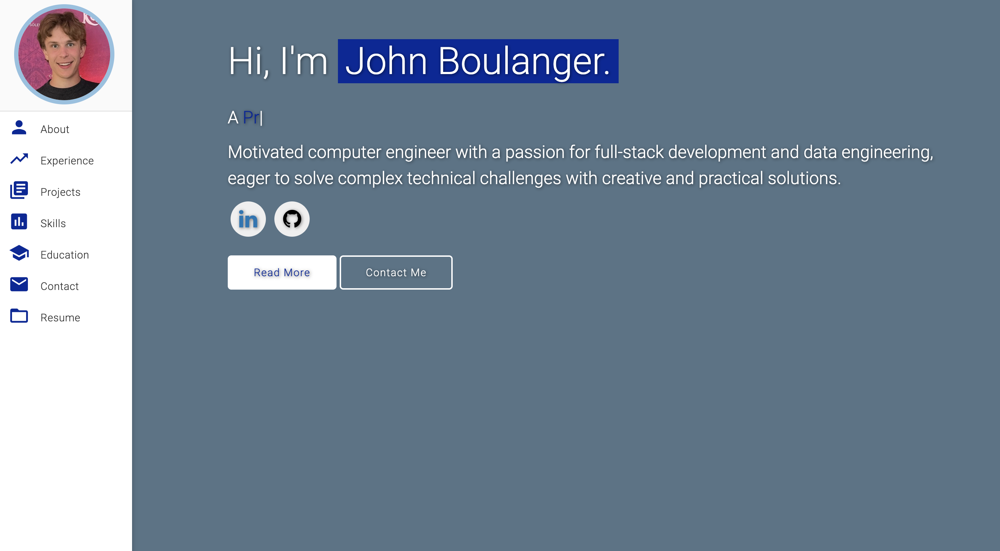
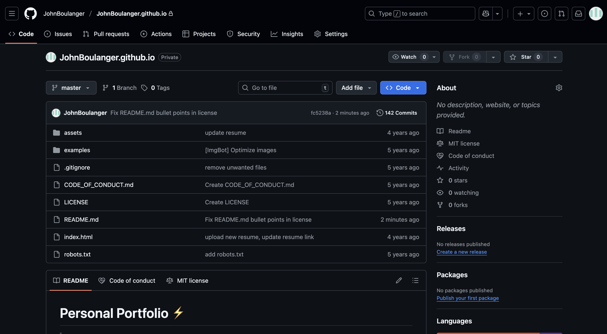
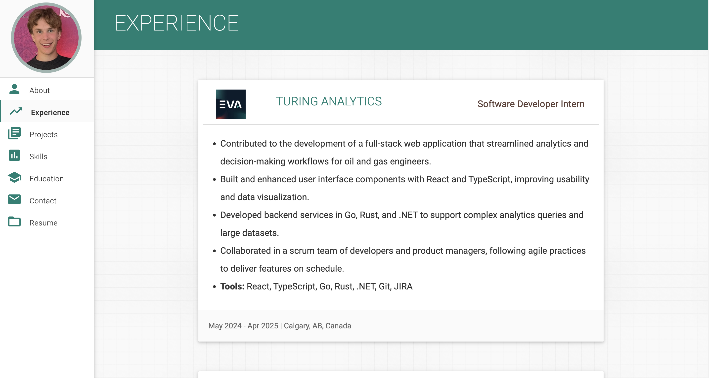
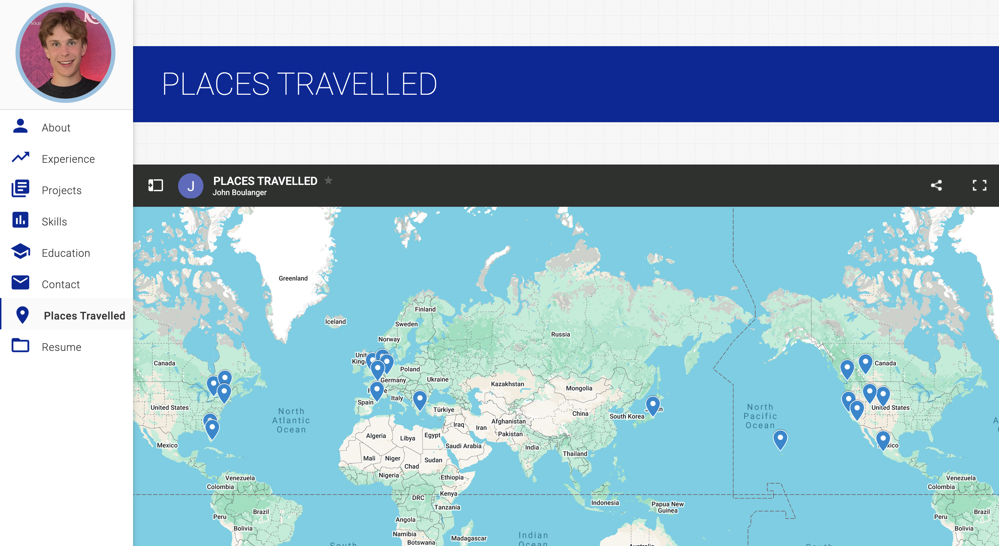
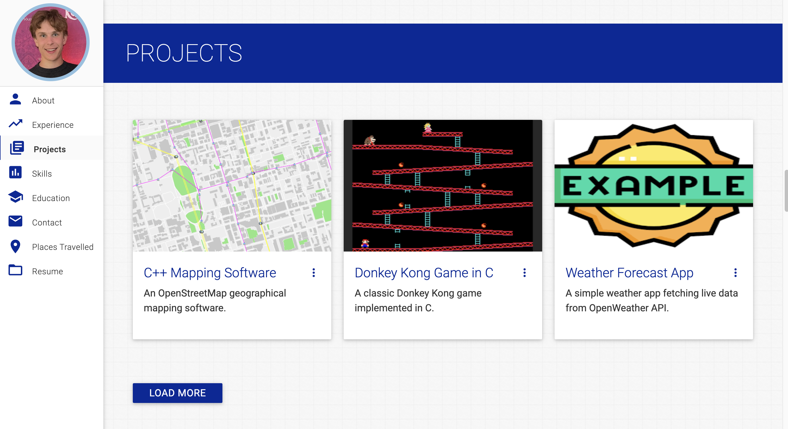
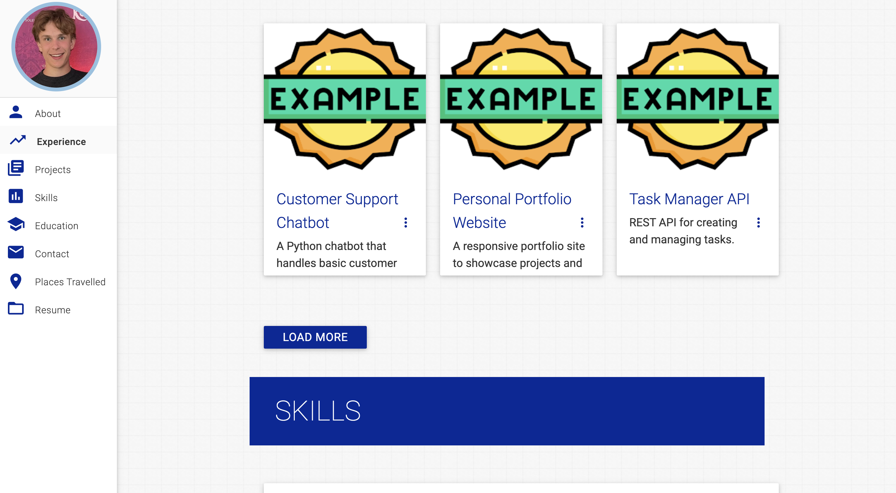
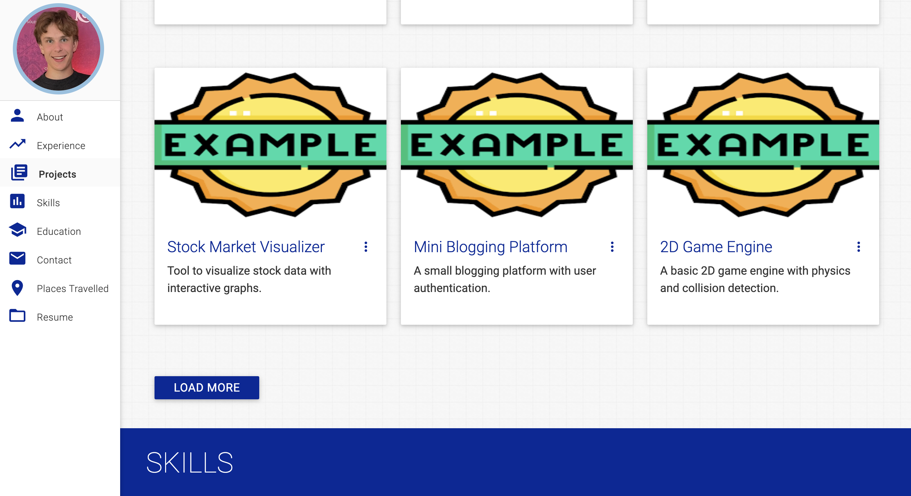
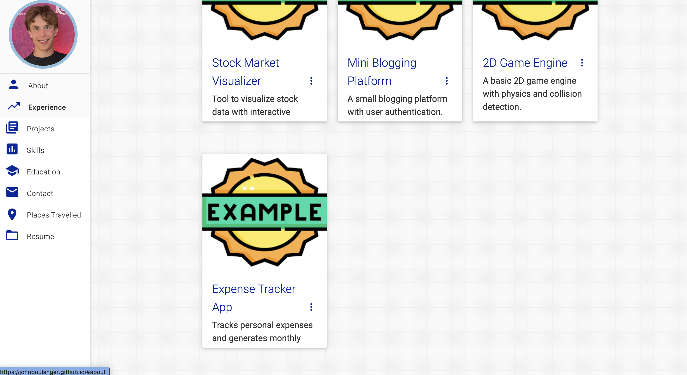

# Personal Portfolio ⚡️ 
> A clean, beautiful, responsive portfolio template for Software Developers!

> https://JohnBoulanger.github.io

 

### Website Preview

 
  <kbd>
    
  </kbd>

:star: Star me on GitHub — it helps!

## Features 📋
⚡️ Fully Responsive\
⚡️ Valid HTML5 & CSS3\
⚡️ Typing animation using `Typed.js`\
⚡️ Easy to modify

## Installation & Deployment 📦
- Clone the repository and modify the content of <b>index.html</b> according to your requirement.
- Add or remove images from `JohnBoulanger.github.io/assets/img/` directory as per your requirement.
- I highly recommend to use [Github Pages](https://create-react-app.dev/docs/deployment/#github-pages) to deploy the website the EASIEST WAY.
- To deploy your website, first you need to create github repository with name `<your-github-username>.github.io`. Please don't give any other name.
- Push the generated code to the `master` branch of this repository.
- <b>NOTE:</b> Make sure to set `analyticsId` from your Google Analytics account inside the Google Analytics script tag, if you want to use your own Google Analytics account.

## Sections 📚
✔️ About me\
✔️ Experience\
✔️ Projects \
✔️ Skills \
✔️ Education\
✔️ Contact Info\
✔️ Resume

To view a live example, **[click here](https://JohnBoulanger.github.io/)**

## Tools Used 🛠️
* [<b>GitHub Pages</b>](https://create-react-app.dev/docs/deployment/#github-pages) - To host my static website (HTML, CSS, JS).
* [<b>Materialize</b>](https://materializecss.com/) - A CSS framework to get Google's Material Design components.
* [<b>Typed.js</b>](https://mattboldt.com/demos/typed-js/) - JavaScript Library

## Contributing 💡
#### Step 1

- **Option 1**
    - 🍴 Fork this repo!

- **Option 2**
    - 👯 Clone this repo to your local machine.

#### Step 2

- **Build your code** 🔨🔨🔨

#### Step 3

- 🔃 Create a new pull request.

## Activity 1
### Create and Clone Repo

 
  <kbd>
    
  </kbd>

## Activity 2
### Add Personal Info

 
  <kbd>
    
  </kbd>

 
  <kbd>
    
  </kbd>

## Activity 3
### Changing Theme Color

 
  <kbd>
    
  </kbd>

## Activity 4
### Embed Google Maps

 
  <kbd>
    
  </kbd>

## Activity 5
### Adding Dynamic Content with JS

 
  <kbd>
    
  </kbd>

 
  <kbd>
    
  </kbd>

 
  <kbd>
    
  </kbd>

 
  <kbd>
    
  </kbd>

## License 📄
* This project is licensed under the MIT License - see the [LICENSE.md](./LICENSE) file for details.
* This repo is a clone of https://github.com/JohnBoulanger/JohnBoulanger.github.io